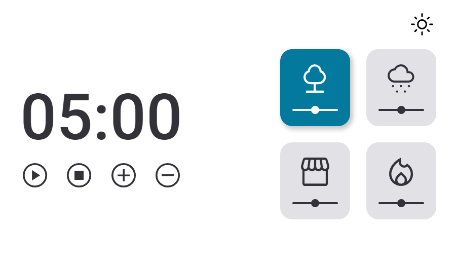
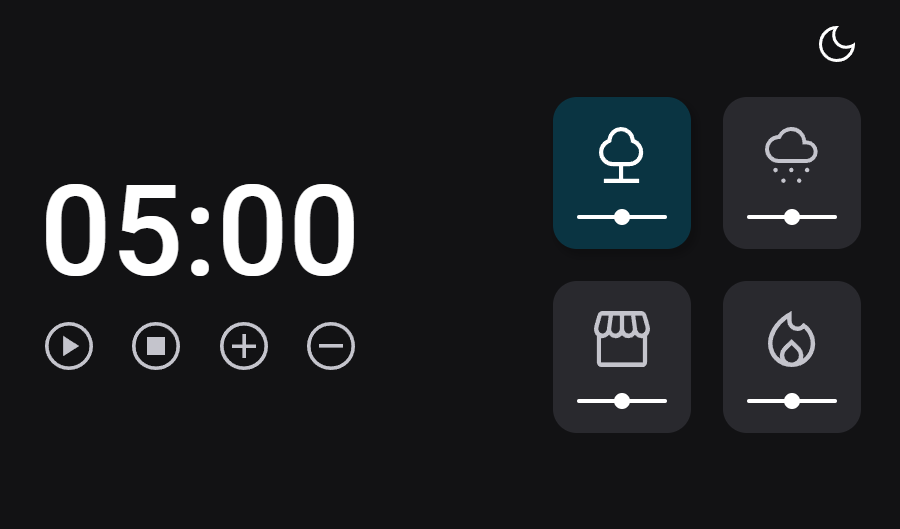

# TIMER 2.0

## An alarm clock that can be programmed by the user, with different ambient sound options.

> The projct aimed create all the HTML, CSS and JavaScript of the application from a FIGMA model, using DOM and ES Modules (EcmaScript 6 - ES6) to build the functionalities of an alarm clock in which the user increases or decreases the timer by 5 minutes, with 4 background music options and their respective volume controls. I also worked on the dark mode option on the page.
> 
> Reinforcing knowledge about HTML, CSS, JavaScript, DOM, node, events, code refactoring, clean code and separating JS into modules.

🔗 [Click here to access](https://matheusborgesdev.github.io/Timer-2.0/)

## 💻 Technologies

- HTML
- CSS
- JavaScript
- ECMAScript 6
- DOM
- Git & Github
- Figma

## 📧 Contact

matheusb.dev@gmail.com
